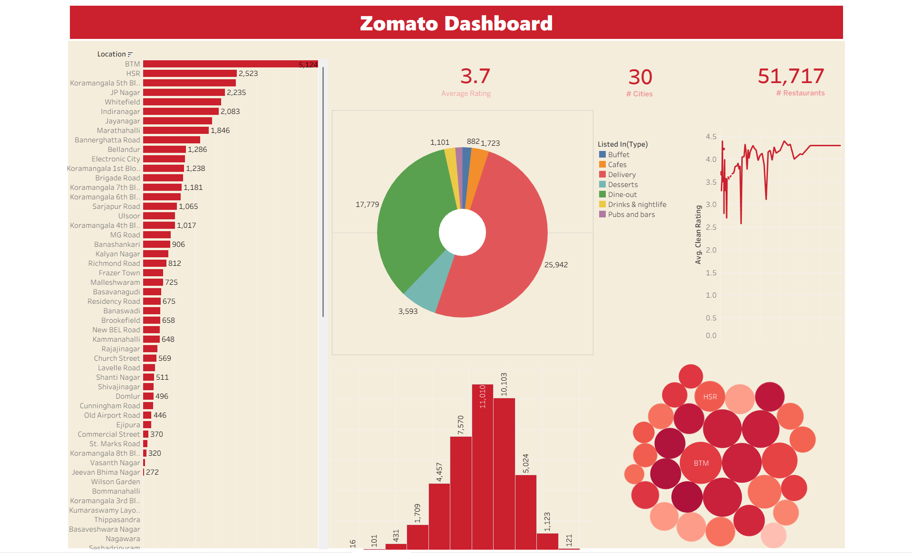

# Zomato Restaurant Analytics Dashboard

An interactive Business Intelligence dashboard built in Tableau, analyzing over 51,000 restaurant data records to uncover consumer dining trends, location distributions, and cost-to-quality correlations.

## 🚀 Live Interactive Dashboard
[Click Here to View the Interactive Dashboard on Tableau Public](https://public.tableau.com/app/profile/pondharani.devendra/viz/zomato_analysis_17822319067840/Dashboard1)

---

## 📊 Dashboard Preview

---

## 💡 Key Business Insights Discovered
* **Location Density:** BTM Layout represents the highest density hub in the dataset, leading with 5,124 individual restaurant locations.
* **Service Ecosystem:** Off-premise dining heavily dominates the market. Online food delivery accounts for 25,942 active listings, completely eclipsing standard dine-out options.
* **Cost vs. Quality Correlation:** Trend line analysis reveals that budget dining options show extreme rating volatility. However, establishments priced between 2,500 and 4,500 secure highly consistent, top-tier consumer ratings.
* **Overall Market Health:** The regional market sustains a healthy average rating of 3.7 across 30 distinct city zones.

## 🛠️ Data Architecture & Visual Components
* **High-Level KPIs:** Aggregated calculations tracking distinct City footprints, Average Ratings, and Total Volume.
* **Distribution Histograms:** Binned distribution tracking the frequency of customer ratings.
* **Categorical Proportions:** Dual-axis donut charting to break down listed service types (Delivery, Dine-out, Desserts, etc.).
* **Spatial Clustering:** Packed bubble charts weighting city footprint by absolute volume.
* **Trend Plotting:** Continuous line mapping to evaluate average cleanliness and overall rating against price escalation.

## 💻 Technical Tools Used
* Tableau Public (Data Visualization & Dashboard Assembly)
* Data Aggregation & Calculated Fields
* Custom UI/UX Layout Design

---

## 📬 Let's Connect
Feel free to reach out to discuss this project or connect regarding data analytics opportunities!

